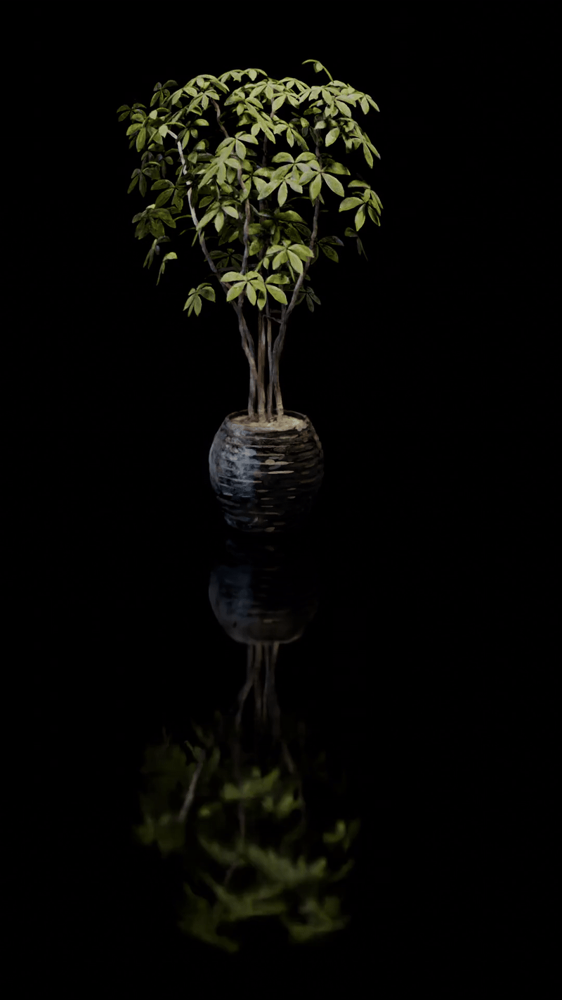
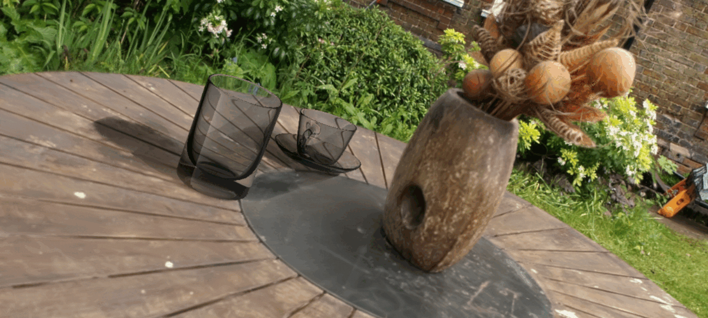
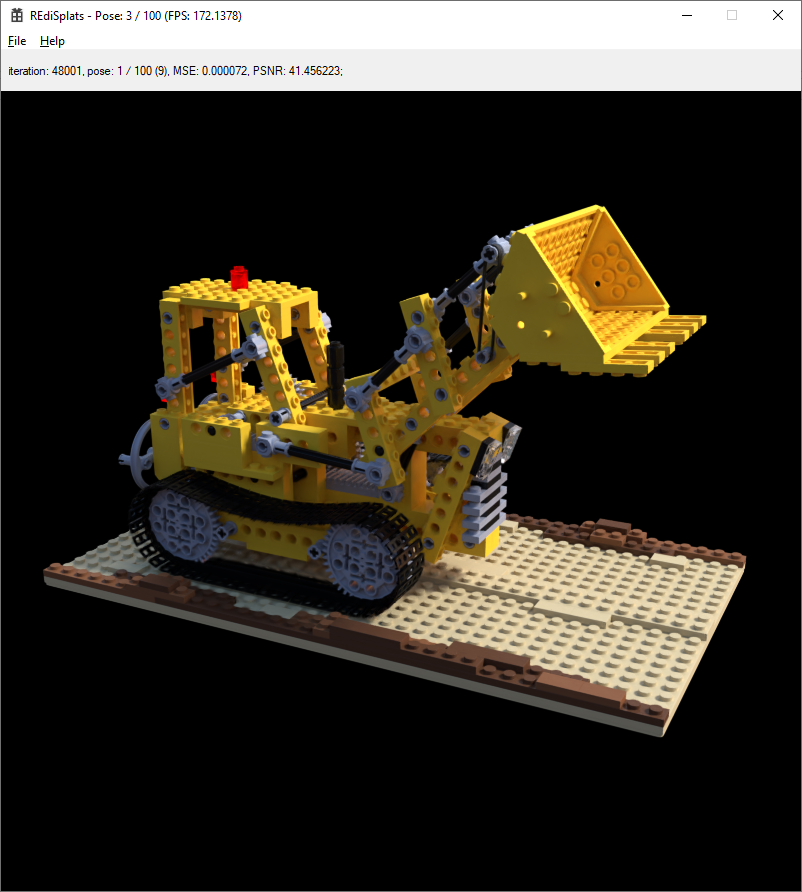

# REdiSplats: Ray Tracing for Editable Gaussian Splatting
Krzysztof Byrski, Grzegorz Wilczyński, Weronika Smolak-Dyżewska, Piotr Borycki, Dawid Baran, Sławomir Tadeja, Przemysław Spurek <br>

| arXiv |
| :---- |
| REdiSplats: Ray Tracing for Editable Gaussian Splatting [https://arxiv.org/pdf/2503.12284](http://arxiv.org/abs/2503.12284)|

|  |  |  |
|--------------|--------------|--------------|
|  |  |  |

# Features
- Spherical harmonics support up to the degree **4**.
- Interactive Windows viewer / optimizer application allowing to preview the trained model state in the real time.
- Support for the **PLY** trained model output format.
- Highly efficient pure Gaussian renderer (no embedding primitive mesh approximation).
- Highly configurable optimizer based on the convenient text configuration file.
- Support for both the **Blender** and **COLMAP** data sets (after some preprocessing by the GaMeS).
- Built-in evaluation of the model and visualization to the *.bmp file with the configurable frequency.

# Controls in the interactive Windows viewer / optimizer application



- **Double Left Click**: Toggle between the **static camera** and the **free roam** mode.
- **Mouse Movement**: Rotate the camera in the **free roam** mode.
- **W / S**: Move forward / backward.
- **A / D**: Step left / right.
- **Spacebar / C**: Move up / down.
- **[ / ]**: Switch the camera to the previous / next training pose.
- **Print Screen**: Make screenshot and save it to the 24-bit *.bmp file.

# Prerequisites:

- Visual Studio 2019 Enterprise;
- CUDA Toolkit 12.4.1;
- NVIDIA OptiX SDK 8.0.0;

# Building the interactive Windows viewer / optimizer application

- Create the new Windows Desktop Application project and name it "REdiSplats";
- Remove the newly generated RaySplats.cpp file containing the code template;
- In **Build Dependencies** -> **Build Customizations...** select the checkbox matching your installed CUDA version. On our test system, we had to select the following checkbox:

  **CUDA 12.4(.targets, .props)**
  
- Add all the files from the directory "REdiSplats" to the project;
- In the project's Properties set **Configuration** to **"Release"** and **Platform** to **"x64"**;
- In **Properties** -> **Configuration Properties** -> **CUDA C/C++** -> **Common** -> **Generate Relocatable Device Code** select **Yes (-rdc=true)**;
- For file "shaders.cuh" in **Properties** -> **Configuration Properties** -> **General** -> **Item Type** select **"CUDA C/C++**;
- For files: "shaders.cuh", "shaders_SH0.cu", "shaders_SH1.cu", "shaders_SH2.cu", "shaders_SH3.cu" and "shaders_SH4.cu" in **Properties** -> **Configuration Properties** -> **CUDA C/C++** -> **Common**:
  - Change the suffix of **Compiler Output (obj/cubin)** from **".obj"** to **".ptx"**;
  - In **Generate Relocatable Device Code** select **No**;
  - In **NVCC Compilation Type** select **Generate device-only .ptx file (-ptx)"**;
- In **Properties** -> **Configuration Properties** -> **VC++ Directories** -> **Include Directories** add OptiX "include" directory path. On our test system, we had to add the following path:
  ```plaintext
  "C:\ProgramData\NVIDIA Corporation\OptiX SDK 8.0.0\include"
  ```
- In **Properties** -> **Configuration Properties** -> **CUDA C/C++** -> **Device** -> **Code Generation** type the compute capability and microarchitecture version of your GPU. On our test system with RTX 4070 GPU we typed:
  ```plaintext
  "compute_89,sm_89"
  ```
- In **Properties** -> **Configuration Properties** -> **Linker** -> **Input** -> **Additional Dependencies** add three new lines containing:
  ```plaintext
  "cuda.lib"
  ```
  ```plaintext
  "cudart.lib"
  ```
  ```plaintext
  "cufft.lib"
  ```
- In each of two different blocks of code in file InitializeOptiXRenderer.cu:
  ```plaintext
  if      constexpr (SH_degree == 0) f = fopen("C:/Users/pc/source/repos/REdiSplats/REdiSplats/x64/Release/shaders_SH0.cu.ptx", "rb");
  else if constexpr (SH_degree == 1) f = fopen("C:/Users/pc/source/repos/REdiSplats/REdiSplats/x64/Release/shaders_SH1.cu.ptx", "rb");
  else if constexpr (SH_degree == 2) f = fopen("C:/Users/pc/source/repos/REdiSplats/REdiSplats/x64/Release/shaders_SH2.cu.ptx", "rb");
  else if constexpr (SH_degree == 3) f = fopen("C:/Users/pc/source/repos/REdiSplats/REdiSplats/x64/Release/shaders_SH3.cu.ptx", "rb");
  else if constexpr (SH_degree == 4) f = fopen("C:/Users/pc/source/repos/REdiSplats/REdiSplats/x64/Release/shaders_SH4.cu.ptx", "rb");
  ```
  and
  ```plaintext
  if      constexpr (SH_degree == 0) f = fopen("C:/Users/pc/source/repos/REdiSplats/REdiSplats/x64/Release/shaders_SH0.cu.ptx", "rt");
  else if constexpr (SH_degree == 1) f = fopen("C:/Users/pc/source/repos/REdiSplats/REdiSplats/x64/Release/shaders_SH1.cu.ptx", "rt");
  else if constexpr (SH_degree == 2) f = fopen("C:/Users/pc/source/repos/REdiSplats/REdiSplats/x64/Release/shaders_SH2.cu.ptx", "rt");
  else if constexpr (SH_degree == 3) f = fopen("C:/Users/pc/source/repos/REdiSplats/REdiSplats/x64/Release/shaders_SH3.cu.ptx", "rt");
  else if constexpr (SH_degree == 4) f = fopen("C:/Users/pc/source/repos/REdiSplats/REdiSplats/x64/Release/shaders_SH4.cu.ptx", "rt");
  ```
  replace the provided path with the path to the *.ptx compiled shaders files on your hdd.

## Training the first model:
----------------------------
- Create the directory "dump" in the main RaySplattingFlatWindows project's directory and then create the subdirectory "dump\save" in the main RaySplattingFlatWindows project's directory. The application will store the checkpoints here. On our test system we created those directories in the following directory:

"C:\Users\\\<Windows username>\source\repos\RaySplattingFlatWindows\RaySplattingFlatWindows"

- Train the model with GaMeS for some small number of epochs (for example 100) on some dataset (for example: "drjohnson" from "Deep Blending" data sets) to obtain the *.ply file containing the pretrained Gaussians;
- Run 3DGS on the same dataset to obtain the cameras.json file (as we found out the cameras.json returned by the GaMeS incorrect);
- Copy the output file cameras.json to the dataset main directory;
- Convert all of the files in the subdirectory "images" located in the dataset main directory to 24-bit *.bmp file format without changing their names;
- Copy the configuration file "config.txt" to the project's main directory. On our test system we copied it to the following directory:

"C:\Users\\\<Windows username>\source\repos\RaySplattingFlatWindows\RaySplattingFlatWindows"

- In lines: 2 and 3 of the configuration file specify the location of the dataset main directory and the output GaMeS *.ply file obtained after short model pretraining;
- Run the "RaySplattingFlatWindows" project from the Visual Studio IDE;

# Scripts
Scripts directory contains different scripts that allows to manipulate trained models.

### Setting up the environment
1. First create your conda environment
2. Install pytorch with CUDA support
```bash
conda install pytorch torchvision torchaudio pytorch-cuda=12.1 -c pytorch -c nvidia
```
3. Install Nvdiffrast
```bash
pip install ninja imageio PyOpenGL glfw xatlas gdown
pip install git+https://github.com/NVlabs/nvdiffrast/
```
4. Install other dependencies
```bash
pip install -r requirements.txt
```
## generate_mesh.py
This script allows you to get the MeshSplat representation of ReDiSplats model. Output is saved as a `.npz` file, it's output path is `/path/to/ply/meshsplat.npz`.

### Usage
```bash
python generate_mesh.py <ply_path> --opac_threshold <opac_thresh_val> --quant <quant_val>
```
where:
- `ply_path` - path to the input PLY file
- `opac_thresh_val` - opacity threshold for the mesh (e.g. if opac_thresh_val=0.5, only Gaussians with opacity greater than 0.5 will be used to generate the mesh), default value is 0.5
- `quant_val` - quantile value (the bigger the larger the MeshSplat size), default value is 4.0

## convert.py
This script allows you to get the Gaussian representation of ReDiSplats model from collection of frames `.obj` files. Output for each frame is saved as a `.ply` file.

### Usage
```bash
python convert.py --ply_path <ply_path> --output_path <output_path> --frames_path <frames_path> --quant <quant_val>
```
where:
- `ply_path` - path to the original PLY file
- `output_path` - path where the calculated `.ply` files for each frame should be saved
- `frames_path` - path to the directory where `.obj` files are stored
- `quant_val` - quantile value (the bigger the larger the MeshSplat size), default value is 4.0

## render_blender.py
This script allows you to render the MeshSplat representation of ReDiSplats model using Blender. Of course you have to have installed Blender already.

### Usage
```bash
blender --background --python path/to/render_blender.py -- --npz_path <path_to_npz_file> --cam_path <path_to_cameras_file>
```
where:
- `--npz_path` - path to the input `.npz` file
- `--cam_path` - path to the input cameras file

## render_nvdiffrast.py
This script allows you to render the MeshSplat representation of ReDiSplats model using Nvdiffrast.

### Usage
```bash
python render_nvdiffrast.py <npz_path> <cameras_path> --dp_layers <dp_layers_val>
```
where:
- `<npz_path>` - path to the input `.npz` file
- `<cameras_path>` - path to the input cameras file. If this is a path to a `.json` file, then the script will assume you are using Blender dataset. If it's a path to a dataset, then the script will assume you are using Colmap dataset.
- `<dp_layers_val>` - number of depth peeling layers, default value is 50. For NeRF Synthetic datasets use 50, for real scenes use at least 100 (recommended is 200).


